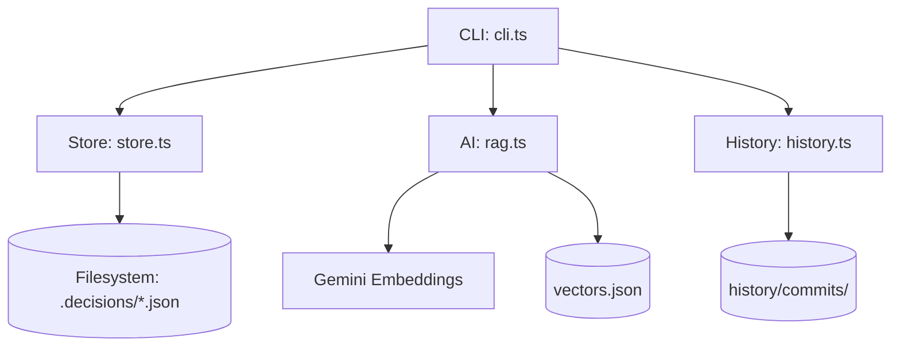
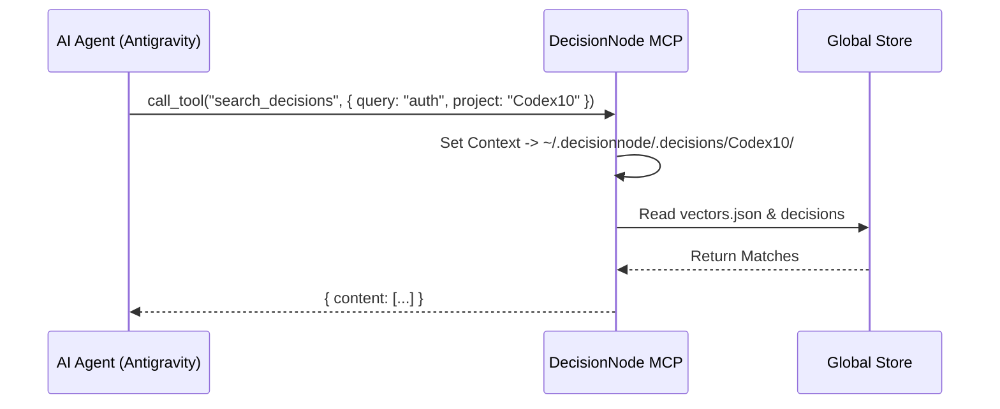

# DecisionNode Architecture

## Data Model

### DecisionNode (Core Unit)
```typescript
type DecisionNode = {
  id: string;
  scope: string;

  decision: string;
  rationale?: string;
  constraints?: string[];
  status: "active" | "deprecated" | "overridden";
  createdAt: string;
  updatedAt?: string;
  overriddenBy?: string;
  tags?: string[];
}
```

### DecisionCommit (Version History)
```typescript
type DecisionCommit = {
  id: string;           // Short hash (e.g., "abc123")
  parentId?: string;    // Previous commit (linear history)
  message: string;      // User-provided description
  timestamp: string;    // ISO 8601
  snapshot: Record<string, DecisionCollection>; // Full state
}
```


**Global Store Location:** `~/.decisionnode/.decisions/`

```
~/.decisionnode/.decisions/
├── Codex10/               ← Project-specific folder
│   ├── ui.json            ← Decision files (flat structure)
│   ├── frontend.json
│   ├── vectors.json       ← Cached AI embeddings for this project
│   └── history/           ← Project-specific version control
│       ├── head.json
│       └── commits/
│           └── {hash}.json
├── AnotherProject/        ← Isolated environment
│   └── ...
└── ...
```

This architecture ensures:
1. **Isolation**: Decisions from one project never leak into another.
2. **Persistence**: Decisions survive even if you delete the project folder.
3. **Zero Configuration**: Folders are auto-created based on the project name.

## CLI Commands

| Command | Description |
|---------|-------------|
| `decide list [--scope <s>]` | List all decisions |
| `decide get <id>` | Get a specific decision |
| `decide search "<query>"` | Semantic search (AI) |
| `decide commit -m "<msg>"` | Snapshot current state |
| `decide log` | Show commit history |

## System Overview



## MCP Integration

DecisionNode implements the **Model Context Protocol (MCP)** to serve as an intelligent memory layer for AI agents (like Antigravity or Windsurf).

### Components
1. **MCP Server (`mcp/server.ts`)**: Exposes tools (`add_decision`, `search_decisions`, `get_log`) over stdio.
2. **Context Awareness**: 
   - Dynamically detects the active project based on the `project` parameter passed by the AI.
   - Automatically switches context to the correct isolation folder (e.g., `~/.decisionnode/.decisions/Codex10/`).

### Workflow


### Sequence Diagram: `add_decision` (Full Detail)

This diagram traces **every function call, file operation, and API request** from the AI agent's tool call to the final response.

```mermaid
sequenceDiagram
    autonumber
    participant AI as AI Agent (Antigravity)
    participant MCP as mcp/server.ts
    participant Env as env.ts
    participant Store as store.ts
    participant History as history.ts
    participant RAG as ai/rag.ts
    participant Gemini as ai/gemini.ts
    participant API as Gemini API (Cloud)
    participant FS as File System

    rect rgb(40, 60, 80)
    Note over AI,FS: PHASE 1: Request Handling & Project Setup
    end

    AI->>MCP: tools/call: add_decision({ scope: "UI", decision: "Use Inter font", project: "Codex10" })
    MCP->>MCP: ensureProject(args)
    MCP->>Env: setCurrentProject("Codex10")
    Env->>Env: currentProjectName = "Codex10"
    Note right of Env: Global variable updated<br/>All future path calls use this

    rect rgb(40, 80, 60)
    Note over AI,FS: PHASE 2: Generate Unique Decision ID
    end

    MCP->>Store: listDecisions()
    Store->>Store: getAvailableScopes()
    Store->>Env: getProjectRoot()
    Env-->>Store: "~/.decisionnode/.decisions/Codex10/"
    Store->>FS: fs.readdir("~/.decisionnode/.decisions/Codex10/")
    FS-->>Store: ["ui.json", "backend.json", "vectors.json"]
    Store->>Store: Filter: ["ui", "backend"] (exclude vectors.json)
    
    loop For each scope file
        Store->>Store: getDecisionFilePath(scope)
        Store->>FS: fs.readFile("~/.../Codex10/ui.json")
        FS-->>Store: { scope: "UI", decisions: [...] }
    end
    
    Store-->>MCP: DecisionNode[] (all existing decisions)
    MCP->>MCP: Filter by scope.toLowerCase() === "ui"
    MCP->>MCP: Count: 4 existing UI decisions
    MCP->>MCP: Generate ID: "ui-005"

    rect rgb(80, 60, 40)
    Note over AI,FS: PHASE 3: Create & Save Decision Object
    end

    MCP->>MCP: Create DecisionNode { id: "ui-005", scope: "UI", decision: "Use Inter font", status: "active", createdAt: ISO8601 }
    MCP->>Store: addDecision(newDecision)
    Store->>Store: loadDecisions("UI")
    Store->>Store: getDecisionFilePath("UI") → sanitize → "ui"
    Store->>Env: getProjectRoot()
    Env-->>Store: "~/.decisionnode/.decisions/Codex10/"
    Store->>FS: fs.readFile("~/.../Codex10/ui.json")
    FS-->>Store: { scope: "UI", decisions: [ui-001, ui-002, ui-003, ui-004] }
    Store->>Store: Check duplicate ID → None found
    Store->>Store: collection.decisions.push(newDecision)
    Store->>Store: saveDecisions(collection)
    Store->>FS: fs.mkdir("~/.../Codex10/", { recursive: true })
    Store->>FS: fs.writeFile("~/.../Codex10/ui.json", JSON.stringify(collection))
    FS-->>Store: ✓ Written

    rect rgb(60, 40, 80)
    Note over AI,FS: PHASE 4: Create Atomic Commit
    end

    MCP->>History: createCommit("Added ui-005: Use Inter font...")
    History->>History: ensureHistoryDirs()
    History->>Env: getProjectRoot()
    Env-->>History: "~/.decisionnode/.decisions/Codex10/"
    History->>FS: fs.mkdir("~/.../Codex10/history/commits/", { recursive: true })
    
    History->>History: getHead()
    History->>FS: fs.readFile("~/.../Codex10/history/head.json")
    FS-->>History: { commitId: "abc12345" } (or null if first commit)
    History->>History: parentId = "abc12345"

    rect rgb(80, 40, 60)
    Note over AI,FS: PHASE 4a: Snapshot All Decision Files
    end

    History->>History: getAvailableScopes()
    History->>Env: getProjectRoot()
    History->>FS: fs.readdir("~/.../Codex10/")
    FS-->>History: ["ui.json", "backend.json", "vectors.json", "history"]
    History->>History: Filter → ["ui", "backend"]
    
    loop For each scope
        History->>Store: loadDecisions(scope)
        Store->>FS: fs.readFile("~/.../Codex10/{scope}.json")
        FS-->>Store: DecisionCollection
        Store-->>History: DecisionCollection
        History->>History: snapshot[scope] = collection
    end
    
    History->>History: Validate: totalDecisions > 0 ✓

    rect rgb(100, 60, 40)
    Note over AI,FS: PHASE 4b: Embed Changed Decisions (AI)
    end

    History->>RAG: updateVectorsForChangedDecisions(snapshot, parentId)
    RAG->>RAG: loadVectorCache()
    RAG->>Env: getProjectRoot()
    RAG->>FS: fs.readFile("~/.../Codex10/vectors.json")
    FS-->>RAG: { "ui-001": [0.1, 0.2, ...], "ui-002": [...], ... }
    
    alt parentId exists
        RAG->>History: getCommit("abc12345")
        History->>FS: fs.readFile("~/.../Codex10/history/commits/abc12345.json")
        FS-->>History: previousCommit with snapshot
        History-->>RAG: previousCommit
        RAG->>RAG: Build previousDecisions Map
    end
    
    RAG->>RAG: Compare current vs previous snapshots
    RAG->>RAG: Find changed: ["ui-005"] (new decision)
    
    loop For each changed decision
        RAG->>RAG: await 1500ms (rate limit protection)
        RAG->>RAG: getDecisionText(decision)
        Note right of RAG: "UI: Use Inter font. Modern readable..."
        RAG->>Gemini: getEmbedding(text)
        Gemini->>Gemini: Check GEMINI_API_KEY exists ✓
        Gemini->>Gemini: genAI.getGenerativeModel("gemini-embedding-001")
        Gemini->>API: model.embedContent(text)
        API-->>Gemini: { embedding: { values: [0.12, 0.98, -0.34, ...] } }
        Gemini-->>RAG: number[] (768 dimensions)
        RAG->>RAG: cache["ui-005"] = embedding
    end
    
    RAG->>RAG: saveVectorCache(cache)
    RAG->>RAG: ensureProjectFolder()
    RAG->>FS: fs.writeFile("~/.../Codex10/vectors.json", JSON.stringify(cache))
    FS-->>RAG: ✓ Written
    RAG-->>History: { embedded: 1, unchanged: 4 }

    rect rgb(40, 80, 80)
    Note over AI,FS: PHASE 4c: Save Commit & Update HEAD
    end

    History->>RAG: loadVectorCache()
    RAG->>FS: fs.readFile("~/.../Codex10/vectors.json")
    FS-->>RAG: Updated cache with all vectors
    RAG-->>History: VectorCache
    
    History->>History: Create DecisionCommit object
    Note right of History: { id: "def67890", parentId: "abc12345",<br/>message: "Added ui-005...",<br/>timestamp: ISO8601,<br/>snapshot: {...}, vectors: {...} }
    
    History->>History: generateCommitId() → "def67890"
    History->>Env: getProjectRoot()
    History->>FS: fs.writeFile("~/.../Codex10/history/commits/def67890.json", JSON.stringify(commit))
    FS-->>History: ✓ Written
    
    History->>History: setHead("def67890")
    History->>FS: fs.writeFile("~/.../Codex10/history/head.json", { commitId: "def67890" })
    FS-->>History: ✓ Written
    
    History-->>MCP: DecisionCommit { id: "def67890", message: "Added ui-005..." }

    rect rgb(40, 60, 100)
    Note over AI,FS: PHASE 5: Format & Return Response
    end

    MCP->>MCP: Build response JSON
    MCP-->>AI: { content: [{ type: "text", text: JSON.stringify({ success: true, decision: { id: "ui-005", scope: "UI" }, commit: { id: "def67890", message: "..." } }) }] }
```



#### Files Written During `add_decision`:
| File | When | Content |
|------|------|---------|
| `~/.decisionnode/.decisions/Codex10/ui.json` | Phase 3 | Updated decisions array |
| `~/.decisionnode/.decisions/Codex10/vectors.json` | Phase 4b | Updated embeddings cache |
| `~/.decisionnode/.decisions/Codex10/history/commits/def67890.json` | Phase 4c | Full snapshot + vectors |
| `~/.decisionnode/.decisions/Codex10/history/head.json` | Phase 4c | New HEAD pointer |
